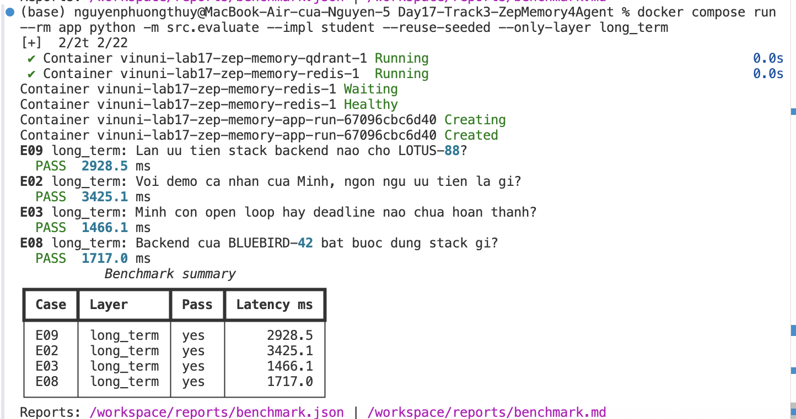
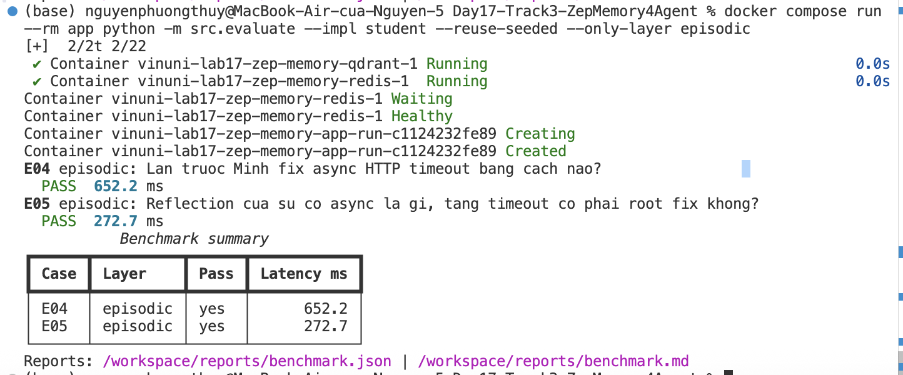
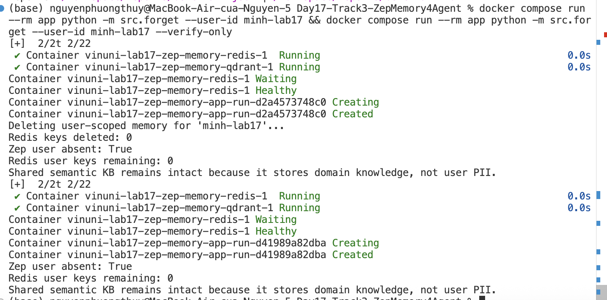

# Phân tích Benchmark

1. **Layer nào có hit rate thấp nhất khi tắt bộ nhớ?**
   Dựa vào file `reports/benchmark_no_memory.md`, các câu hỏi thuộc Episodic và Long-term đều bị miss toàn bộ (hit rate 0%). Nhưng khi bật memory, các layer đều pass 100%. Về bản chất, Semantic dễ fail nếu dùng sai scope (auto thay vì episodes làm mất từ khoá literal), còn Episodic dễ fail nếu không lấy đủ trajectory cũ hoặc budget không đủ để chứa toàn bộ ngữ cảnh.

2. **Query nào retrieve nhiều token nhất?**
   Câu E07 (mixed layer) hoặc các query truy xuất semantic thường kéo về nhiều token nhất do cần trộn nhiều fact từ `Context Block` và kiến thức chuyên ngành từ `Knowledge Base`.

3. **Case mixed (E07) cần kết hợp memory nào? Evidence nào bắt buộc?**
   E07 cần kết hợp Long-term memory để biết preference cá nhân (code Python) và Semantic memory để biết rule retry của hệ thống (dùng Idempotency-Key). Evidence bắt buộc: `Python` và `Idempotency-Key`.

4. **Token reduction so với full source context? Vì sao no-memory reduction cao nhưng hit rate thấp?**
   Cơ chế Context Budget và Layering giúp thu gọn token rất hiệu quả so với việc nhét toàn bộ chat history vào. Khi tắt memory (no_memory), token reduction đạt mức cao nhất vì không hề gửi context nào từ quá khứ, dẫn tới hit rate bằng 0 do agent mất hoàn toàn dữ kiện để trả lời.

---

# Tự Luận

5. **Layer quan trọng nhất trong bộ test này?**
   Trong bộ test, **Long-term memory** rất quan trọng (có 4/11 case: E02, E03, E08, E09) vì nó lưu giữ fact và preferences qua nhiều phiên làm việc. Tương tự, **Short-term memory** (E01, E10) xử lý hiệu quả các context gần nhất. Zep xử lý cực kỳ tốt case mâu thuẫn (E08) bằng cách để Fact mới (TypeScript) đè Fact cũ.

6. **Trade-off giữa Context Block / Zep và Redis+Qdrant?**
   Dùng Zep tiết kiệm lượng lớn code logic cho sliding window, context compaction, vector embedding và ranking. Zep cung cấp Graph Context "ăn liền" với sự liên kết user. Trong khi đó, Redis + Qdrant đòi hỏi tự code tay mọi rule về eviction, TTL, chunking,... nhưng lại không bị phụ thuộc vào cloud và độ trễ call API bên thứ 3.

7. **Guardrail chống memory poisoning?**
   Lab có mô phỏng script `heartbeat.py` để cleanup nhưng chỉ với quyền hạn giới hạn (de-duplicate, mark stale tasks) và được chạy offline. Bằng cách không cấp quyền thêm instruction độc hại (giới hạn trong schema/rule), ta bảo vệ bộ nhớ khỏi việc bị "đầu độc" do câu lệnh injection từ prompt của người dùng.

---

# Minh chứng (Screenshots)

*Lưu ý: Đã đặt các ảnh chụp màn hình vào thư mục `submission/`*

1. **Long-term Layer:**
   

2. **Episodic Layer:**
   

3. **Semantic Layer:**
   

4. **Privacy Drill:**
   
